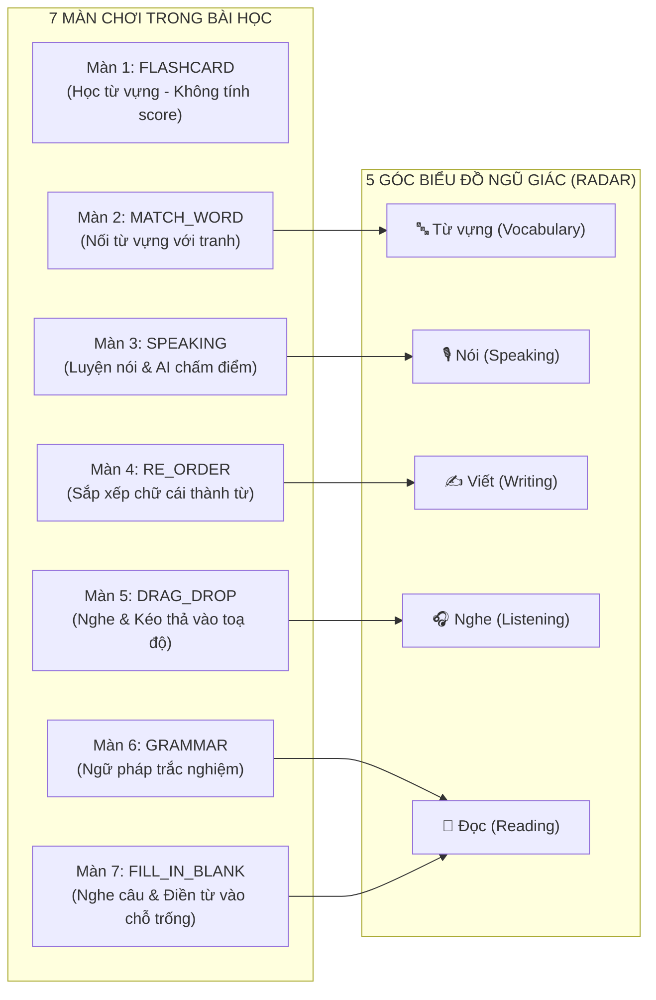

# 📚 KẾ HOẠCH & MA TRẬN PHÂN TÍCH NĂNG LỰC HỌC TẬP (7 MÀN CHƠI $\leftrightarrow$ 5 KỸ NĂNG NGŨ GIÁC)
> **Đề tài Khóa luận Tốt nghiệp:** Ứng dụng ENjoy - Nền tảng học tiếng Anh tương tác cá nhân hóa ứng dụng AI  
> **Trọng tâm nghiên cứu:** Ma trận phát hiện điểm mạnh/yếu qua các màn chơi & Vòng lặp cải thiện thích ứng (Closed-loop Adaptive Learning)

---

## 🎮 I. MA TRẬN CÁC MÀN CHƠI $\leftrightarrow$ CƠ CHẾ PHÁT HIỆN ĐIỂM MẠNH / YẾU (DETECTION MATRIX)

Trong hệ thống ENjoy, mỗi Part bài học bao gồm **7 màn chơi tương tác (7 Game Rounds)** ánh xạ vào **5 góc biểu đồ ngũ giác (Radar Chart)**:



---

### BẢNG CHI TIẾT CƠ CHẾ PHÁT HIỆN QUA TỪNG MÀN CHƠI:

| Màn chơi (Round) | Dạng câu hỏi & Tương tác | Kỹ năng Ngũ giác | Cơ chế tính điểm |
| :--- | :--- | :--- | :--- |
| **MÀN 1: FLASHCARD**<br>*(Học từ vựng)* | Xem flashcard từ vựng, nghe phát âm và hình ảnh minh họa. | *Không tính score* | Khởi động, làm quen từ mới. Không tính vào điểm ngũ giác. |
| **MÀN 2: MATCH_WORD**<br>*(Nối từ vựng)* | Ghép từ tiếng Anh tương ứng với hình ảnh minh họa. | **🔤 Từ vựng (Vocabulary)** | Tính trên tổng số từ nối. Đúng không lỗi $\to$ 100%, có lỗi sai $\to$ lưu Mistake (`roundType = 2`). |
| **MÀN 3: SPEAKING**<br>*(Luyện nói)* | Nhấn mic ghi âm phát âm từ vựng, AI chấm điểm. | **🎙️ Nói (Speaking)** | Tính trên số câu luyện nói. AI chấm điểm, phát âm sai $\to$ lưu Mistake (`roundType = 3`). |
| **MÀN 4: RE_ORDER**<br>*(Sắp xếp chữ cái)* | Nhập/xếp các chữ cái xáo trộn thành từ vựng hoàn chỉnh. | **✍️ Viết (Writing)** | Tính trên số từ cần gõ. Gõ sai $\to$ lưu Mistake (`roundType = 4`). |
| **MÀN 5: DRAG_DROP**<br>*(Nghe & kéo thả)* | Nghe âm thanh và kéo thả các từ vựng vào đúng tọa độ trên tranh. | **🎧 Nghe (Listening)** | Tính trên số điểm tọa độ/từ kéo thả. Kéo nhầm $\to$ lưu Mistake (`roundType = 5`). |
| **MÀN 6: GRAMMAR**<br>*(Ngữ pháp trắc nghiệm)* | Đọc lý thuyết ngữ cảnh và trả lời các câu trắc nghiệm ngữ pháp. | **📖 Đọc (Reading)** | Tính trên số câu hỏi trắc nghiệm ngữ pháp (`roundType = 6`). |
| **MÀN 7: FILL_IN_BLANK**<br>*(Điền từ vào câu)* | Nghe câu mẫu, đọc câu có chỗ trống và chọn từ điền vào. | **📖 Đọc (Reading)** | Tính trên số câu điền từ ngữ pháp (`roundType = 7`). |

---

## 💡 II. LUỒNG KỊCH BẢN THỰC TẾ MINH HỌA (END-TO-END WALKTHROUGH)

Hãy cùng theo dõi ví dụ thực tế của một học sinh tên **Bé Nam** học Chủ đề: **"Wild Animals" (Động vật hoang dã)**:

```
[BƯỚC 1: HỌC BÀI (SESSION PLAYER)]
 ├── Màn 1 (Đọc thoại): Nam đọc câu chuyện về sở thú -> Hoàn thành tốt (Đọc: 90%)
 ├── Màn 2 (Nghe): Nghe "Elephant" -> Chọn đúng tranh voi (Nghe: 85%)
 ├── Màn 3 (Nói vào mic): Đọc câu "The giraffe is tall" 
 │     └── ❌ AI phát hiện Nam phát âm sai từ "giraffe" và "tall" (Nói: 40%) 
 │         ➔ Backend tự động log lỗi sai roundType=3 (Speaking) vào Mistake Bank
 ├── Màn 4 (Quiz từ vựng): Chọn nghĩa từ "Crocodile" -> Nam chọn đúng (Từ vựng: 80%)
 └── Màn 5 (Xếp câu): Ghép câu "Monkeys like bananas"
       └── ❌ Nam xếp nhầm thành "Bananas like monkeys" (Viết: 50%)
           ➔ Backend tự động log lỗi sai roundType=5 (Writing) vào Mistake Bank

[BƯỚC 2: HIỂN THỊ ĐIỂM SỐ TRÊN NGŨ GIÁC (PERSONAL STATS PAGE)]
 ├── Nghe: 85%  (Mạnh 🟢)
 ├── Đọc: 90%   (Mạnh 🟢)
 ├── Từ vựng: 80% (Khá 🟢)
 ├── Viết: 50%  (Trung bình 🟡)
 └── Nói: 40%   (Yếu nhất 🔴)

[BƯỚC 3: HỆ THỐNG TỰ ĐỘNG CHẨN ĐOÁN (DIAGNOSIS)]
 ├── 🚨 Cảnh báo: Kỹ năng Nói & Phát âm đang là điểm nghẽn thấp nhất (40%)
 ├── 🔍 Nguyên nhân cụ thể: Nam đang gặp khó khăn khi phát âm các từ âm dài như "giraffe", "tall" (2 lỗi chưa sửa).
 └── 💬 Lời khuyên AI: "Ba mẹ hãy cùng Nam bấm nghe lại phát âm mẫu của từ 'giraffe' 2 lần trước khi nói nhé!"

[BƯỚC 4: HÀNH ĐỘNG CẢI THIỆN 1-CLICK (ACTIONABLE CTA)]
 ├── Nam bấm nút: [ 🚀 Luyện tập ngay 2 câu phát âm còn yếu ]
 ├── Hệ thống mở MistakePracticePlayer (lọc đúng 2 câu sai ở Màn 3)
 ├── Nam phát âm lại đúng chuẩn (AI chấm 95%) ➔ Hoàn thành Spaced Repetition Step 1
 └── 🏆 Điểm kỹ năng Nói trên Ngũ giác nhảy vọt từ 40% lên 75%!
```

---

## 📐 III. CÔNG THỨC TOÁN HỌC TÍNH ĐIỂM NGŨ GIÁC DỰA TRÊN DỮ LIỆU THỰC TẾ

Điểm của mỗi kỹ năng $S_k$ ($k \in \{1, 2, 3, 4, 5\}$) tại một thời điểm được tính theo công thức:

$$S_k = \frac{\sum_{i=1}^{N_k} \text{MasteryScore}(q_{i, k})}{N_k} \times 100$$

Trong đó:
* $N_k$: Tổng số câu hỏi thuộc kỹ năng $k$ mà học sinh đã làm qua các Session.
* $\text{MasteryScore}(q_{i, k})$: Điểm làm chủ của câu hỏi thứ $i$:
  * Nếu làm **Đúng ngay từ đầu (không bị ghi vào Mistake)**: $\text{MasteryScore} = 1.0$ (100%).
  * Nếu làm **Sai (bị ghi vào Mistake)**:
    * Mới sai, chưa luyện lại: $\text{MasteryScore} = 0.0$
    * Đã luyện lại đúng 1 ngày: $\text{MasteryScore} = 0.33$
    * Đã luyện lại đúng 2 ngày: $\text{MasteryScore} = 0.67$
    * Đã làm chủ hoàn toàn (Streak $\ge 3$ ngày): $\text{MasteryScore} = 1.0$ (100% Khắc phục thành công).

---

## 🎯 IV. THIẾT KẾ GIAO DIỆN CHẨN ĐOÁN & SỬA LỖI TRÊN `PersonalStatsPage.tsx`

```text
+---------------------------------------------------------------------------------------------------+
|  📊 THỐNG KÊ NĂNG LỰC & CHẨN ĐOÁN ĐIỂM YẾU HỌC TẬP                                                |
+---------------------------------------------------------------------------------------------------+
|                                                                                                   |
|     [ BIỂU ĐỒ NGŨ GIÁC 5 KỸ NĂNG ]                [ 🧠 KHUNG CHẨN ĐOÁN TỰ ĐỘNG CỦA HỆ THỐNG ]     |
|                                                                                                   |
|                   Nghe (85%)                      🚨 ĐIỂM CẦN ƯU TIÊN: NÓI & PHÁT ÂM (40%)        |
|                    /\                                                                             |
|       Từ vựng(80%)/  \ Đọc (90%)                  📌 Bóc tách nguyên nhân từ Màn chơi:            |
|                  /    \                           • Màn 3 (Nói): Phát âm sai từ "giraffe", "tall" |
|                 |      |                          • Màn 5 (Xếp câu): Nhầm trật tự từ chủ đề Safari|
|                 \      /                                                                          |
|       Viết(50%)  \____/  Nói (40%)                👉 [ 🚀 BẮT ĐẦU ÔN LUYỆN KỸ NĂNG NÓI (2 CÂU) ]  |
|                                                                                                   |
+---------------------------------------------------------------------------------------------------+
|  📋 CHI TIẾT CÁC CÂU CẦN KHẮC PHỤC (LẤY TỪ MISTAKE BANK)                                           |
|                                                                                                   |
|  [🎙️ Kỹ năng Nói]                                                                                 |
|  • Câu: "The giraffe is tall"  |  Bé đã đọc: "The giraf is tol" (Thiếu âm đuôi) | [Ôn tập ngay]    |
|                                                                                                   |
|  [✍️ Kỹ năng Viết]                                                                                 |
|  • Câu: "Monkeys like bananas" |  Bé đã xếp: "Bananas like monkeys"            | [Ôn tập ngay]    |
+---------------------------------------------------------------------------------------------------+
```

---

## 🚀 V. HƯỚNG DẪN CODE TRIỂN KHAI CHO DỰ ÁN

### 1. Backend: Bổ sung logic gom nhóm lỗi theo từng Màn chơi (`roundType`)
Tại `learning-service` (`UserProgressServiceImpl.java`):
* `roundType = 1`: Màn 1 - Flashcard (Học từ vựng)
* `roundType = 2`: Màn 2 - Match Word (Nối từ vựng $\to$ Kỹ năng Vocabulary)
* `roundType = 3`: Màn 3 - Speaking (Luyện nói $\to$ Kỹ năng Speaking)
* `roundType = 4`: Màn 4 - Re-order (Sắp xếp chữ cái $\to$ Kỹ năng Writing)
* `roundType = 5`: Màn 5 - Drag & Drop (Nghe và kéo thả $\to$ Kỹ năng Listening)
* `roundType = 6`: Màn 6 - Grammar (Ngữ pháp trắc nghiệm $\to$ Kỹ năng Reading)
* `roundType = 7`: Màn 7 - Fill in Blank (Điền từ vào chỗ trống $\to$ Kỹ năng Reading)

### 2. Frontend: Điều hướng chuẩn xác vào `MistakePracticePlayer`
Khi người dùng bấm nút khắc phục:
```typescript
const handlePracticeWeakestSkill = (weakestRoundType: number) => {
  // Điều hướng vào player ôn tập lỗi sai theo đúng roundType của kỹ năng yếu
  navigate(`/practice/mistakes?roundType=${weakestRoundType}`);
};
```

---

## 🏆 VI. GIÁ TRỊ HỌC THUẬT KHI BẢO VỆ KHÓA LUẬN
1. **Liên kết chặt chẽ Gameplay $\leftrightarrow$ Năng lực**: Không chỉ là game đơn thuần, từng tương tác click/nói/kéo thả đều là một điểm dữ liệu đo lường năng lực (Educational Data Points).
2. **Khắc phục chính xác theo phương pháp Spaced Repetition**: Giải thích rõ với Hội đồng cách hệ thống giúp học sinh biến trí nhớ ngắn hạn thành dài hạn thông qua việc làm lại đúng các câu sai ở từng màn chơi.
