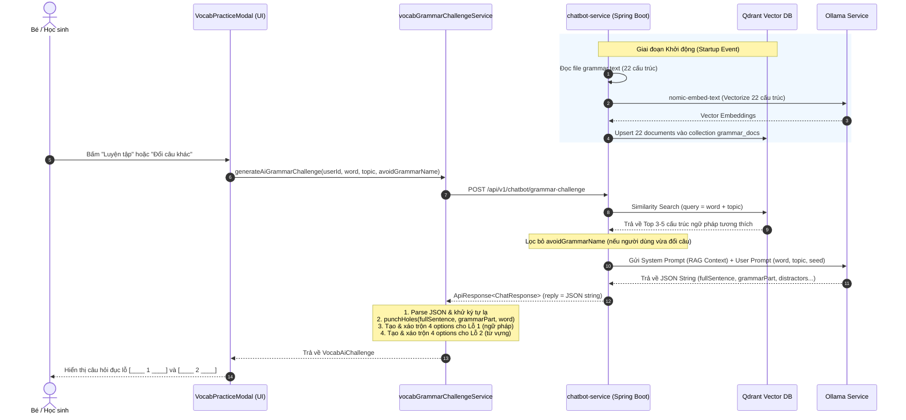

# TÀI LIỆU THIẾT KẾ & LUỒNG HOẠT ĐỘNG: RAG VOCABULARY & GRAMMAR CHALLENGE

> **Hệ thống**: Nền tảng học tiếng Anh ENjoy  
> **Chức năng**: Sinh câu thử thách Luyện tập Từ vựng kết hợp Ngữ pháp (Vocab Practice Modal)  
> **Công nghệ sử dụng**: Spring AI, Qdrant Vector Database, Ollama (`qwen2.5:7b` & `nomic-embed-text`), React / TypeScript  
> **Ngày cập nhật**: 06/10/2026  

---

## 1. TỔNG QUAN & BỐI CẢNH NÂNG CẤP

### 1.1. Vấn đề trước đây
* **Frontend gửi kèm toàn bộ tài liệu**: Mỗi lần người dùng bấm luyện tập một từ vựng, Frontend phải đính kèm toàn bộ file tài liệu ngữ pháp thô (~2KB - 5KB) vào `context` gửi cho AI.
* **Tốn băng thông & chi phí tính toán**: Lặp lại payload lớn không cần thiết cho mỗi request.
* **Hiện tượng thiên vị (Bias / Repetition)**: Do tài liệu dài và prompt cố định, AI thường xuyên chỉ chọn đi chọn lại một cấu trúc ngữ pháp phổ biến duy nhất (ví dụ: *"There is / There are"*).
* **Lỗi đục lỗ & mất đáp án**: AI tự đục lỗ dễ làm mất dấu câu, làm sai vị trí hoặc quên sinh đáp án đúng trong danh sách lựa chọn.

### 1.2. Giải pháp RAG Pipeline (Hiện tại)
1. **Lưu trữ tri thức (Knowledge Base) vào Vector DB**: Toàn bộ 22 cấu trúc ngữ pháp Cambridge Pre-A1 Starters được chunking, embedding và nạp sẵn vào **Qdrant Vector Database**.
2. **Truy vấn ngữ nghĩa tự động (Semantic Search)**: Khi người dùng cần luyện tập từ vựng, Frontend chỉ gửi `{ word, topic, avoidGrammarName }`. Backend tự tìm trong Qdrant Top 3-5 cấu trúc ngữ pháp phù hợp ngữ cảnh nhất với từ vựng đó.
3. **AI sinh câu hoàn chỉnh**: Mô hình LLM (`qwen2.5:7b`) chỉ nhận ngữ pháp phù hợp và sinh 1 câu tiếng Anh hoàn chỉnh (chưa đục lỗ).
4. **Programmatic Hole-punching**: Thuật toán độc lập tại Frontend tự dò tìm vị trí từ vựng và ngữ pháp để đục lỗ chính xác 100%, tự trộn các phương án nhiễu mà không phụ thuộc vào việc AI có đục đúng hay không.

---

## 2. KIẾN TRÚC HỆ THỐNG (SYSTEM ARCHITECTURE)

```
┌─────────────────────────────────────────────────────────────────────────────┐
│                             FRONTEND (React/TS)                             │
│  - VocabPracticeModal.tsx: Giao diện học sinh làm bài                       │
│  - vocabGrammarChallengeService.ts: Gọi API, đục lỗ (punchHoles), shuffle   │
└──────────────────────────────────────┬──────────────────────────────────────┘
                                       │ POST { word, topic, avoidGrammarName }
                                       ▼
┌─────────────────────────────────────────────────────────────────────────────┐
│                           API GATEWAY / SPRING BOOT                         │
│  - Endpoint: /api/v1/chatbot/grammar-challenge (ChatController.java)         │
└──────────────────────────────────────┬──────────────────────────────────────┘
                                       ▼
┌─────────────────────────────────────────────────────────────────────────────┐
│                      BACKEND: CHATBOT-SERVICE (Port 8085)                   │
│                                                                             │
│  1. GrammarRAGService.java                                                  │
│     ├── Cold-Start: Đọc grammar.text ➔ Chunk 22 bài ➔ Embed ➔ Nạp Qdrant    │
│     └── Query: Semantic Search Top-K ngữ pháp thích hợp theo từ & chủ đề     │
│                                                                             │
│  2. GrammarChallengeService.java                                            │
│     └── Ghép RAG Context + Seed ngẫu nhiên ➔ Gửi Ollama ChatClient          │
└──────────────────┬───────────────────────────────────────┬──────────────────┘
                   │ Vector Search                         │ Prompt + Context
                   ▼                                       ▼
┌────────────────────────────────────┐  ┌─────────────────────────────────────┐
│        QDRANT VECTOR STORE         │  │             OLLAMA LLM              │
│       (Docker Port 6333/6334)      │  │        (Local Port 11434)           │
│  - Collection: grammar_docs        │  │  - nomic-embed-text (Embedding)     │
│  - 22 vectors cấu trúc ngữ pháp    │  │  - qwen2.5:7b (Text Generation)     │
└────────────────────────────────────┘  └─────────────────────────────────────┘
```

---

## 3. SƠ ĐỒ TUẦN TỰ (SEQUENCE DIAGRAM)



---

## 4. CÁC FILE NGUỒN LIÊN QUAN

| Thành phần | Đường dẫn file | Vai trò chính |
|---|---|---|
| **RAG Service** | `Backend/chatbot-service/.../service/GrammarRAGService.java` | Khởi tạo vector store, query tương đồng trong Qdrant |
| **Challenge Service** | `Backend/chatbot-service/.../service/GrammarChallengeService.java` | Kết hợp RAG context + Prompt Ollama sinh câu |
| **Controller** | `Backend/chatbot-service/.../controller/ChatController.java` | Tiếp nhận endpoint POST `/api/v1/chatbot/grammar-challenge` |
| **Request DTO** | `Backend/chatbot-service/.../dto/GrammarChallengeRequest.java` | Record chứa `word`, `topic`, `avoidGrammarName` |
| **Config** | `Backend/chatbot-service/src/main/resources/application.yml` | Cấu hình Ollama embedding model và kết nối Qdrant |
| **Tài liệu gốc** | `Backend/chatbot-service/src/main/resources/grammar.text` | 22 cấu trúc ngữ pháp Cambridge Pre-A1 Starters |
| **Client API** | `Web/enjoy-web/.../learning/services/chatbotApi.ts` | Phương thức gọi API trực tiếp hoặc qua Gateway |
| **Client Logic** | `Web/enjoy-web/.../exam/services/vocabGrammarChallengeService.ts` | Programmatic hole-punching, đảm bảo 4 lựa chọn mỗi lỗ |

---

## 5. CHI TIẾT DỮ LIỆU NHẬN & TRẢ (DATA CONTRACTS)

### 5.1. Request: Frontend ➔ Backend
* **URL:** `POST http://localhost:8085/api/v1/chatbot/grammar-challenge` (hoặc qua Gateway port 8888)
* **Headers:** `Content-Type: application/json`
* **Body:**
```json
{
  "word": "sun",
  "topic": "THE WORLD AROUND US",
  "avoidGrammarName": "There is/There are"
}
```

| Tham số | Kiểu dữ liệu | Bắt buộc | Ý nghĩa |
|---|---|---|---|
| `word` | `String` | Có | Từ vựng mục tiêu cần ôn luyện (ví dụ: "cat", "apple", "sun") |
| `topic` | `String` | Có | Chủ đề học của từ (ví dụ: "ANIMALS", "THE WORLD AROUND US") |
| `avoidGrammarName` | `String` | Không | Tên ngữ pháp cần tránh để tạo câu khác khi bấm "Đổi câu khác" |

---

### 5.2. Response: Backend ➔ Frontend
* **Response Wrapper:** `ApiResponse<ChatResponse>`
* **Status Code:** `200 OK`
* **Body mẫu:**
```json
{
  "code": 200,
  "message": "Success",
  "data": {
    "reply": "{\n  \"grammarName\": \"Present continuous\",\n  \"fullSentence\": \"The sun is shining in the sky.\",\n  \"grammarPart\": \"is shining\",\n  \"grammarWrong\": [\"are shining\", \"shines\", \"shined\"],\n  \"vocabWrong\": [\"moon\", \"star\", \"cloud\"],\n  \"translation\": \"Mặt trời đang chiếu sáng trên bầu trời.\",\n  \"hint\": \"Bé chú ý mặt trời là số ít nên dùng 'is' nhé!\"\n}"
  }
}
```

**Cấu trúc JSON bên trong trường `reply`:**
```json
{
  "grammarName": "Present continuous",
  "fullSentence": "The sun is shining in the sky.",
  "grammarPart": "is shining",
  "grammarWrong": [
    "are shining",
    "shines",
    "shined"
  ],
  "vocabWrong": [
    "moon",
    "star",
    "cloud"
  ],
  "translation": "Mặt trời đang chiếu sáng trên bầu trời.",
  "hint": "Bé chú ý mặt trời là số ít nên dùng 'is' nhé!"
}
```

---

### 5.3. Output sau khi Client đục lỗ (`VocabAiChallenge`)
Frontend nhận chuỗi JSON từ backend, bóc tách và thực hiện `punchHoles()` để biến đổi thành đối tượng `VocabAiChallenge` hiển thị lên giao diện:

```typescript
{
  "grammarId": "Present continuous",
  "grammarName": "Present continuous",
  "sentence": "The [____ 2 ____] [____ 1 ____] in the sky.",
  "translation": "Mặt trời đang chiếu sáng trên bầu trời.",
  "hint": "Bé chú ý mặt trời là số ít nên dùng 'is' nhé!",
  "blanks": [
    {
      "index": 1,
      "type": "grammar",
      "correctAnswer": "is shining",
      "options": ["shines", "is shining", "are shining", "shined"] // Đã trộn ngẫu nhiên
    },
    {
      "index": 2,
      "type": "vocab",
      "correctAnswer": "sun",
      "options": ["moon", "star", "sun", "cloud"] // Đã trộn ngẫu nhiên
    }
  ]
}
```

---

## 6. THUẬT TOÁN ĐỤC LỖ PROGRAMMATIC HOLE-PUNCHING

Để loại bỏ hoàn toàn lỗi AI sinh câu bị mất từ hoặc đục lỗ sai, thuật toán `punchHoles()` tại Frontend hoạt động như sau:

1. **Tìm kiếm vị trí `grammarPart`**: Sử dụng `indexOf()` không phân biệt hoa thường để xác định khoảng `[gStart, gEnd]`.
2. **Tìm kiếm vị trí `vocabWord`**: Tìm vị trí chính xác của từ vựng qua Regular Expression `\bword\b` sao cho khoảng `[vStart, vEnd]` **không bị chồng chéo** lên vùng ngữ pháp.
3. **Sắp xếp thứ tự xuất hiện**: Sắp xếp 2 lỗ theo vị trí xuất hiện trong câu (từ trái qua phải). Lỗ nào xuất hiện trước sẽ được thay thế trước.
4. **Đảm bảo 4 phương án lựa chọn**:
   * Hàm `ensureGrammarOptions()` lấy đáp án đúng + các distractors từ AI; nếu thiếu sẽ bù từ danh sách fallback Pre-A1 chuẩn để luôn có đủ **4 lựa chọn duy nhất**.
   * Hàm `ensureVocabOptions()` lấy từ mục tiêu + 3 từ nhiễu cùng topic; nếu thiếu sẽ bù từ danh sách từ vựng thông dụng để luôn đủ **4 lựa chọn duy nhất**.

---

## 7. CƠ CHẾ CHỊU LỖI & PHÒNG NGỪA RỦI RO (RESILIENCE)

1. **Khi Qdrant Vector Store bị tắt hoặc lỗi kết nối:**
   * Trong `GrammarRAGService`, khối `try-catch` sẽ bắt lỗi, ghi log và chuyển sang chế độ dự phòng (fallback prompt) để AI vẫn sinh câu Pre-A1 bình thường mà không làm sập server.
2. **Khi AI sinh ký tự ngoại lai (tiếng Trung, Hàn):**
   * Frontend có bộ lọc Regular Expression phát hiện và tự động thay thế bằng chuỗi dịch/gợi ý chuẩn tiếng Việt.
3. **Khi Chatbot-Service hoặc Ollama ngoại tuyến:**
   * Frontend có 2 cấp độ fallback:
     * *Cấp 1*: Thử gọi qua API Gateway (8888), nếu lỗi chuyển sang gọi trực tiếp Port 8085.
     * *Cấp 2*: Nếu cả 2 đều mất kết nối, hệ thống kích hoạt **Ultra-fallback offline** sinh câu mẫu chuẩn mực từ bộ từ điển ngữ pháp tích hợp sẵn ở Client.
